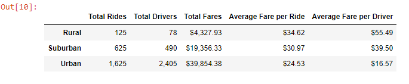

# PyBer Ride-share Data Analysis

## Overview of the Analysis
This analysis uses the Pandas library with ride-share data stored in two separate CSV files to summarize the performance of the ride-sharing app comparing between urban, suburban, and rural cities. One CSV is the city data that includes information on the city name, amount of drivers operating in that city and the type of city. The second contains information on each ride, from the city the ride took place, the date, total fare, and a ride identification number. These CSV files were read and combined into a single Pandas DataFrame by merging using the city column, then the data was grouped by their city types to find the total amount of rides, total number of drivers, the average fare per ride for each city type. Additionally the average fare for a ride and the average fare of each driver were calculated.

Additionally the merged DataFrame was used to create a time series plot of the total fares separated by the city type for each week from January 2019 to April 2019. To produce this plot, data in the Fares column was grouped by the type and the date and aggregated by the sum. As a DataFrame the data was filtered to only the values between the dates of interest and then the DataFrame was converted into a pivot table. The Pandas resample() function further grouped the data into weekly subsets with the sum of the fares, still by city type. Matplotlib was used to produce a line graph of the data.

## Results
### Ride-Share Summary DataFrame

On average the fares earned per ride and also by each driver in rural and suburban areas are greater than those for rides in urban areas. However the large difference in usage of the app in urban areas results in the total amount of fares in those areas being nearly twice than what is earned in suburban areas and over 9 times for rural areas, making the performance in urban cities fare greater.

### Total Fares Between January and April

The discrepancy between the total amount of fares is further illustrated when viewing them over a period between January 2019 to April 2019; throughout the period the total fares earned by rides taking place in urban cities were often 1.5 times the amounts for suburban cities and 5 times the amounts for rural cities. Additionally the earnings for rural cities is less consistent, often increasing one week to decrease the next except for a period in March that has a few concurrent weeks of growth. Urban cities also exibit this bouncing behavior just before March until April, but unlike rural cities that have lows of less than $100 in total fares, the low points in this period rarely dip below $2,000 in total fares.

## Summary

Based on the analysis the following recommendations are advised:
1. Since utitlization is lower in both suburban and rural areas, look into ways such as increased advertising or running first-time specials to introduce the app to new customers and increase usage in these areas. In general the average fares in these locations are higher likely due to the increased distances that are likely traveled in these cities, with the drivers operating in these locations earning much more on average than their urban counterparts. If usage can increase in a way that doesn't drastically lower the cost overall in the long-term for riders to use the app in these locations, it would help decrease the disparity in these places earning less total fares.
2. Increase fares for trips taken in urban cities. Further analyses would be required to determine a suitable amount, but as long as it doesn't impact usage in urban cities the average fares per each ride is lower in these areas. Again this likely stems from a difference in distance traveled resulting in shorter rides. This move could serve to alienate some current customers requiring caution if it carried out, something like small base fee would likely be seen as lower impact while still bringing the average fare per ride closer to the other city types.
3. Lower the amount of drivers operating in urban areas if it does not impact wait times to serve customers in these areas; alternatively, if wait times are an issue in suburban and rural areas, seek to increase drivers in those areas. This is another place analysis would required, but from the current analysis there is an obvious discrepancy in drivers operating in these areas compared to the number of rides performed. It seems more reasonable to assume the former is more likely an issue, as the ratios of total drivers per total rides performed in rural and suburban cities are less than 2 rides per 1 driver; on average 1 driver performing less than 2 rides in a period spanning multiple months doesn't seem unreasonable. By contrast the total number of drivers in urban areas is greated than the total number of rides performed, indicating some drivers did not even take any passengers throughout the period sampled in this analysis. This would lower the discrepancies in the average fares per driver, differences which are even greater the average fares per rides.
